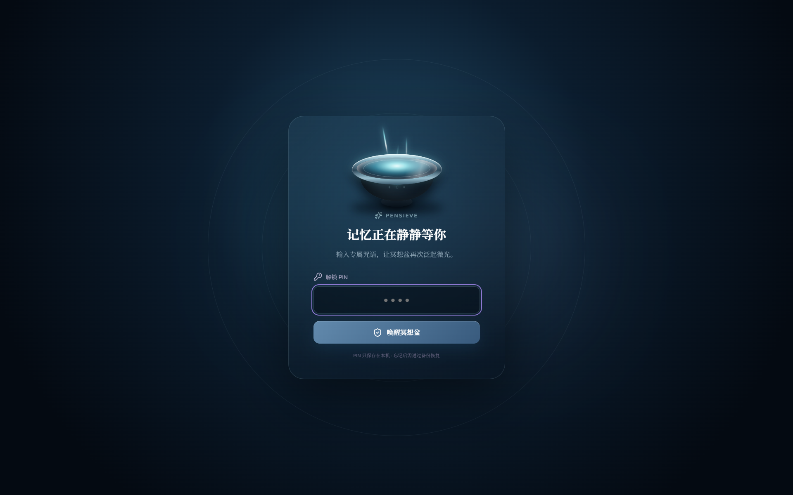

<div align="center">

[**English**](README.en.md) · **简体中文**

# Pensieve · 冥想盆

### 把值得珍藏的时刻，轻轻放进一片会呼吸的深水。

一款冷色、沉浸、本地优先的 Windows 记忆应用。自由写下或说出原始记忆，<br />
再沿着人物、情绪、时间与声音，让它们从冥想盆中重新浮现。

[](https://github.com/YiheHuang/Pensieve/releases/latest)
[](https://github.com/YiheHuang/Pensieve/releases/latest)
[](https://tauri.app/)
[](LICENSE)

**[下载 Windows 安装包](https://github.com/YiheHuang/Pensieve/releases/latest)** · **[中文使用手册](docs/使用手册.md)** · **[English Guide](docs/User-Guide.en.md)**

</div>

---

<p align="center"></p>

> 截图来自锁定界面，不含记忆正文、附件、API 密钥或其他私人数据。

## Pensieve 是什么？

普通日志要求先整理再记录。Pensieve 反过来：先接住未经修饰的原文，再由可选 AI 提取标题、时间、情绪与线索。正文始终保留用户写下的版本。

| 体验 | v0.2.0 中可以做什么 |
| --- | --- |
| 💧 **提取记忆** | 只写正文即可，也可加入图片、音频、视频或语音；高级选项按需展开。 |
| 🪄 **注入仪式** | 等待 AI 明确返回结果期间，魔杖与冥想盆动画持续循环。 |
| 🎭 **多元情绪** | 一个主情绪、至多三个副情绪；六类标准标签均可筛选。 |
| 🧩 **人物与主题** | 人物、地点、主题分栏去重，减少重复与格式漂移。 |
| 🌊 **沉浸回放** | 媒体在上、原文在下；冷色“回忆”滤镜降低视觉干扰。 |
| ✏️ **自由维护** | 正文、发生时间和附件均可增删改；AI 只整理元数据。 |
| 💗 **最珍贵记忆** | 爱心不再只是标识，可在长廊中独立筛选。 |
| 🗑️ **回收站** | 支持唤醒或彻底删除；彻底删除同时清理加密附件。 |
| 🌐 **中英双语** | 默认中文，可在“偏好与守护”中切换 English。 |
| 🔐 **本地守护** | PIN、本地加密、系统凭据和独立密码备份共同守护记忆。 |

## 立即开始

1. 打开 [Pensieve v0.2.0 Release](https://github.com/YiheHuang/Pensieve/releases/tag/v0.2.0)。
2. 下载并运行 `Pensieve-Setup-0.2.0.exe`。
3. 创建 4–8 位数字 PIN，并填写你的称呼。
4. 如需 AI，前往 **偏好与守护** 配置 OpenAI 兼容接口。
5. 进入 **提取**，写下第一段原始记忆。

完整说明见：[中文使用手册](docs/使用手册.md) · [English User Guide](docs/User-Guide.en.md)

## v0.2.0 重点

- 全屏无边框沉浸界面与应用内“结束冥想”。
- 首次使用引导、用户称呼和中英文切换。
- 精简提取表单，并等待 AI 完成后再进入详情。
- 主/副多情绪系统、标准情绪约束和跨分类标签去重。
- 原始正文保护：AI 不再生成或覆盖正文摘要。
- 正文、发生时间及附件编辑。
- 珍贵记忆筛选、真实今日回响、回收站彻底删除。
- 兼容 OpenAI Structured Outputs 子集及 OpenLux 等中转接口。

完整变更记录见 [v0.2.0 Release](https://github.com/YiheHuang/Pensieve/releases/tag/v0.2.0)。

## 隐私与数据

- 正文、结构化信息和附件在桌面端加密保存。
- PIN 通过 Argon2id 派生密钥；API 密钥交由 Windows 系统凭据保管。
- AI 默认关闭，仅在启用后请求用户配置的兼容服务。
- `.pensieve` 备份使用独立密码加密，且不包含 AI API 密钥。
- 回收站“彻底删除”会移除数据库记录、相关索引和加密附件。

## 技术构成

```text
界面       React 19 · TypeScript · Vite · Zustand · TanStack Query
桌面       Tauri 2 · Rust · WebView2
存储       SQLite · AES-256-GCM · Argon2id
质量       Vitest · Testing Library · Oxlint · Rust checks
```

## 本地开发

```powershell
git clone https://github.com/YiheHuang/Pensieve.git
cd Pensieve
npm install
npm run dev
npm run tauri dev
```

检查与构建：

```powershell
npm test
npm run lint
npm run build
npm run tauri:build:gnu
```

## 参与项目

欢迎通过 [Issues](https://github.com/YiheHuang/Pensieve/issues) 分享体验、提交问题或提出新的沉浸想法。

---

<div align="center">

**愿每一段被珍惜的记忆，都有再次发光的地方。**

Released under the [MIT License](LICENSE).

</div>
