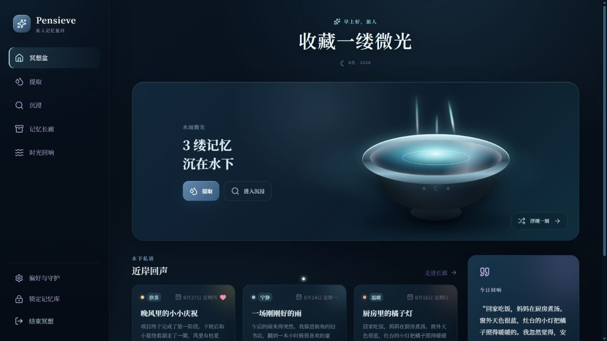
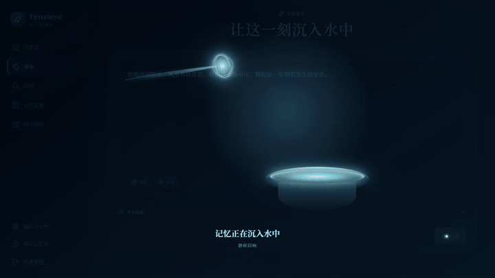
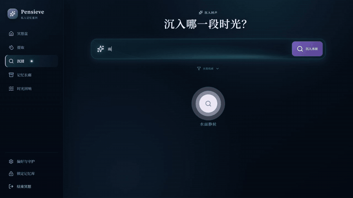
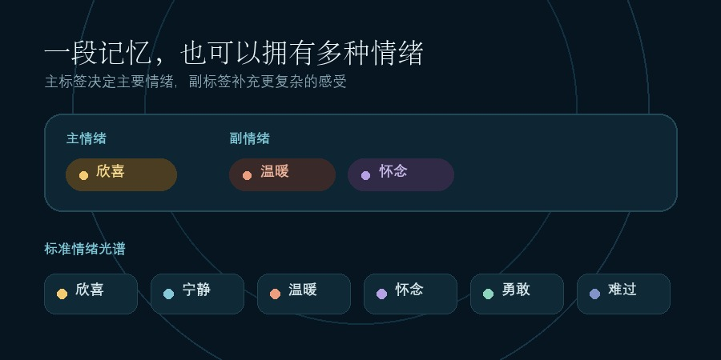
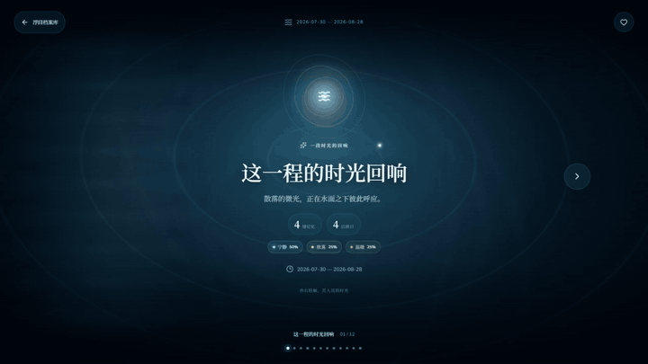
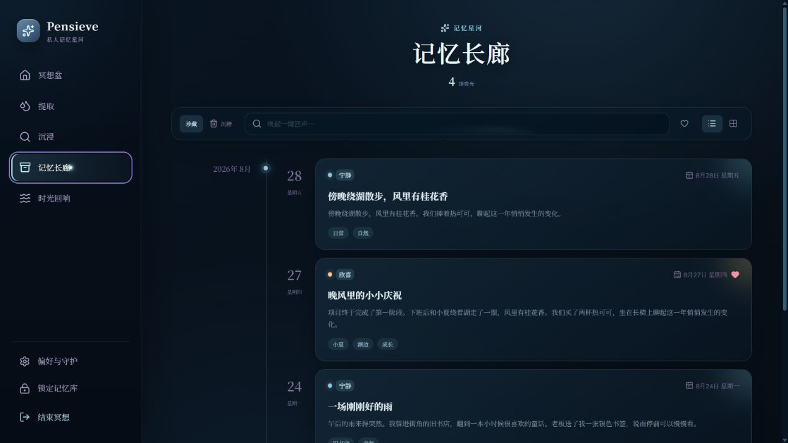
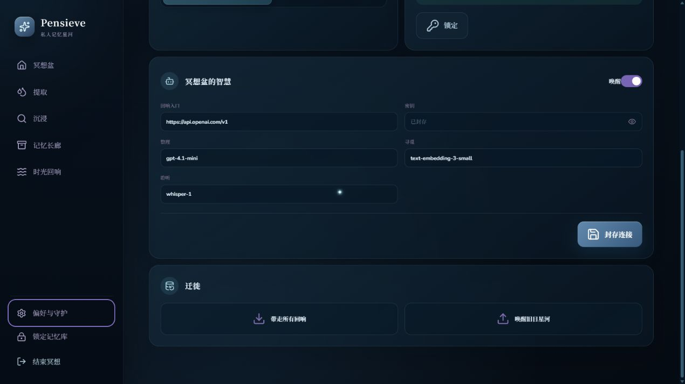
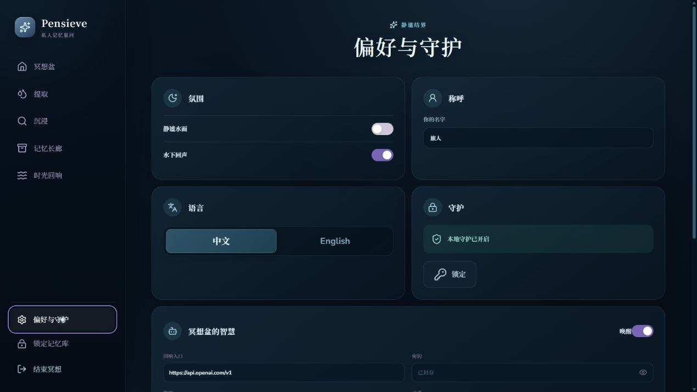
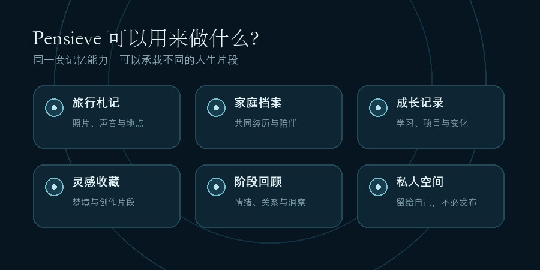
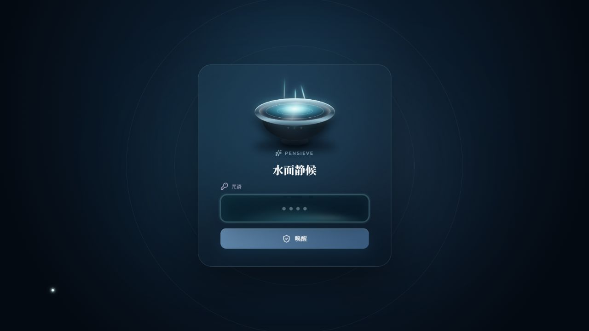

# 我把《哈利·波特》的“冥想盆”，做成了一款私人记忆软件

> 一和札记 ·「创造」

如果现实里真的有一只冥想盆，它应该能做什么？

我的答案是：**保存文字、照片、视频与声音；用 AI 整理情绪和线索；通过一句模糊的描述找回往事；再把一整段时间，汇聚成一份可以沉浸阅读的报告。**

于是，我做了 **Pensieve**——一款面向 Windows 的本地优先私人记忆应用。

## 01｜只写内容，其余交给 AI

记录一段记忆时，默认界面只保留一个正文输入区。

你可以写下一段话，也可以加入照片、视频、音频，或者直接录下一段声音。标题、情绪、时间和标签都放进高级选项，需要时再填写。

点击“提取”后，魔杖会带着记忆微光进入冥想盆。应用会等待 AI 返回完整结果，再进入记忆详情。

AI 会完成这些整理：

- 从正文中提取标题；
- 判断一个主情绪和最多三个副情绪；
- 识别人物、地点与主题事件；
- 对标签进行标准化和去重。

**原始正文保持原样。** AI 负责整理线索，而不是生成摘要、改写措辞或替你重新讲述这段经历。

这套流程的目的很直接：降低记录成本。打开 Pensieve，写下内容，点击提取，就完成了。

## 02｜记得很模糊，也能把它找回来

传统搜索通常要求你记得关键词。但回忆往往只剩下一些场景：

> “下雨时去过的旧书店。”
> “和朋友在湖边散步的那一次。”
> “最近让我觉得很温暖的事情。”

在“沉浸”页面，可以直接用这样的自然语言寻找记忆。

还可以继续按主情绪或副情绪、起止日期、媒体类型和爱心状态缩小范围。

找到记忆后，可以进入沉浸回放。图片会应用低亮、冷色的“回忆滤镜”，与正文分区显示；音频、视频和文字在同一环境中播放，避免明亮图片遮挡阅读。

正文、发生时间和附件都可以继续增删修改，也可以重新运行 AI 分析。重新分析只更新标题、情绪与标签，正文仍保持原样。

## 03｜一段记忆可以同时拥有多种情绪

Pensieve 使用六类标准情绪：**欣喜、宁静、温暖、怀念、勇敢、难过**。

AI 会给出一个主情绪，也可以给出若干副情绪。例如，一次毕业聚会的主情绪可能是“欣喜”，同时带有“温暖”和“怀念”。

这些标签会真正参与搜索、筛选和统计，而不是只显示在卡片上的装饰。

人物、地点和主题标签也分别存储并在本地去重，避免同一个词同时出现在多个类别中。

## 04｜用“时光回响”总结一段时间

选择一个北京时间范围，Pensieve 可以读取期间正在珍藏的记忆，生成一份多维度 AI 报告。

报告包括记忆数量、活跃天数、附件数量、情绪分布、情绪轨迹、人物与关系、地点与场景、主题事件、珍贵片段、变化洞察和一段“时光寄语”。

报告会作为独立快照保存进档案库，可以重命名、收藏或删除。

阅读时每次显示一个章节，通过左右按钮、方向键或触屏滑动切换。代表性片段还可以直接“沉入原记忆”。

## 05｜记忆长廊、珍藏与今日回响

所有记忆都会进入“记忆长廊”，可以使用时间线或网格方式浏览。

点亮爱心后，这段记忆会进入“最珍贵记忆”筛选；主页的“今日回响”则会从真实的本地记忆中带回一个旧日片段。

删除的记忆先进入回收站，可以恢复；选择彻底删除时会再次确认，并同步清理记录、索引和相关附件。

## 06｜附件会复制进记忆库，而不是只保存路径

加入照片、音频或视频后，桌面版会把附件复制进应用的加密存储区域。

即使原文件移动、改名或被清理，记忆中的附件仍然存在。导出 `.pensieve` 备份时，全部记忆、媒体附件和时光回响档案会一起打包；恢复时也会完整回到冥想盆中。

## 07｜本地优先，以及 AI 的边界

Pensieve 的 Windows 桌面版使用本地加密数据库保存记忆和报告，附件同样加密存储。

AI 默认关闭。用户可以在“偏好与守护”中配置自己的 OpenAI 兼容接口，包括自定义 API 地址、模型与密钥。

生成“时光回响”时，图片、视频和音频原文件留在本地；已有的音频转写可以参与总结。

应用还提供 PIN 锁定、中英文界面、减少动态效果和 Windows 高对比度适配。称呼由每位用户自行设置。

## 08｜它可以用来做什么？

Pensieve 可以成为旅行中的照片与声音札记、家庭私人档案、成长记录、灵感与梦境收藏、阶段性情绪回顾，或者一个不必发布到社交网络的个人记忆空间。

## 09｜现在开始使用

Pensieve 已经开源，并提供 Windows 安装包。

1. 下载并安装 Pensieve；
2. 设置自己的称呼与 4—8 位数字 PIN；
3. 在“偏好与守护”中按需启用 AI；
4. 进入“提取”，保存第一段记忆。

- 项目主页：<https://github.com/YiheHuang/Pensieve>
- Windows 安装包：<https://github.com/YiheHuang/Pensieve/releases/latest>
- 使用手册：<https://github.com/YiheHuang/Pensieve/blob/main/docs/%E4%BD%BF%E7%94%A8%E6%89%8B%E5%86%8C.md>

如果你喜欢这种以沉浸体验保存与寻找记忆的方式，欢迎试用 Pensieve，也欢迎在 GitHub 提交建议或参与改进。

一和
写于「一和札记 · 创造」

> 说明：Pensieve 是独立开发的开源个人项目，灵感来自“以容器承载和重访记忆”的幻想意象，与 J.K. Rowling、Warner Bros.、Wizarding World 及其关联方无隶属或合作关系。相关作品名与商标归各自权利人所有。
